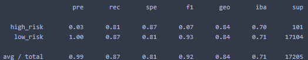

# credit_risk_analysis

## Overview
The objective of this analysis is to create several different supervised machine learning models to judge credit card risk.
These different models included using different sampling methods with Logistic Regression to predict credit card risk.
Another strategy consisted of using ensemble algorithms (both bagging and boosting) to try and predict the credit card risk.
## Results
### Logistic Regression with Random Oversampling Accuracy Score

### Logistic Regression with Random Oversampling Classification Report

### Logistic Regression with SMOTE Accuracy Score

### Logistic Regression with SMOTE Classification Report

### Logistic Regression with Cluster Centroids Undersampling Accuracy Score

### Logistic Regression with Cluster Centroids Undersampling Classification Report

### Logistic Regression with SMOTEENN Accuracy Score

### Logistic Regression with SMOTEENN Classification Report

### Balanced Random Forest (Bagging) Accuracy Score

### Balanced Random Forest (Bagging) Classification Report

### Easy Ensemble (AdaBoost) Accuracy Score

### Easy Ensemble (AdaBoost) Classification Report

- As can be seen from the tables above the lowest overall accuracy model is by far the Balanced Random Forest model at 79% accuracy.
The recall of this model for high risk loans is also quite poor at 70%.
- The other models have at least an 81% overall accuracy also with recall coverage of at least 80% too for high risk loans.
- The standout model is by far the Easy Ensemble (AdaBoost) algorithm.
This model has an excellent overall accuracy of 93% with a recall coverage of 92% for high risk loans. 

## Summary
My recommendation for a ML model to be used for these credit card high risk loan identifications would be the Easy Ensemble algorithm.
The high recall indicates that the model has a low chance of classifying a high risk loan as a low risk loan.
This model (as well as the other models) had a low precision for identifying high risk loans.
This indicates that if a loan is identified as being high risk there is a good chance that it is a false positive.
However, since the cost to the lender for credit card loans could be high, it is more advantageous to rule out the false positives with higher levels of scrutiny that it would be to report a false negative for an actual high risk loan.